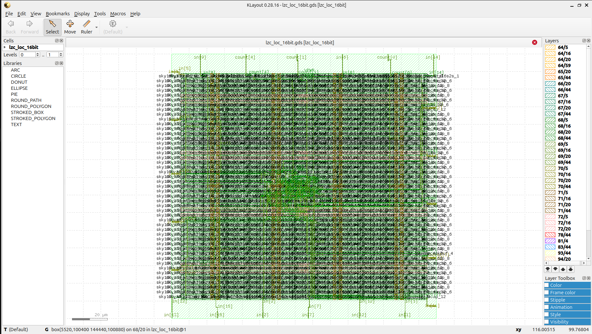
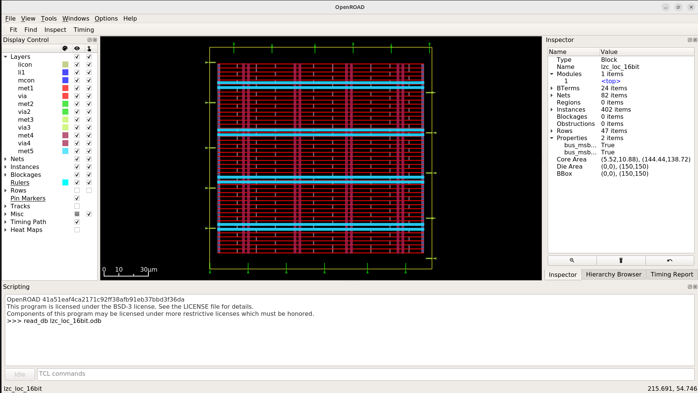
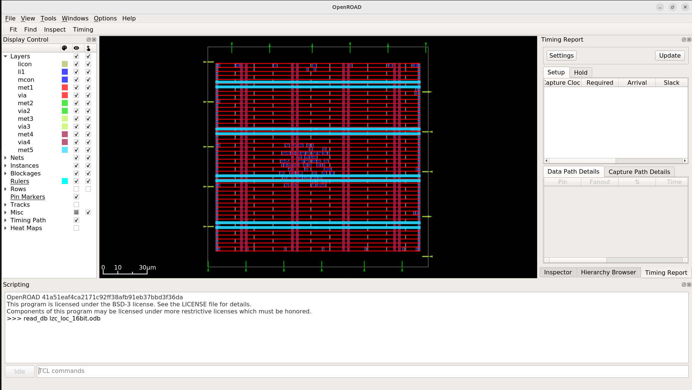
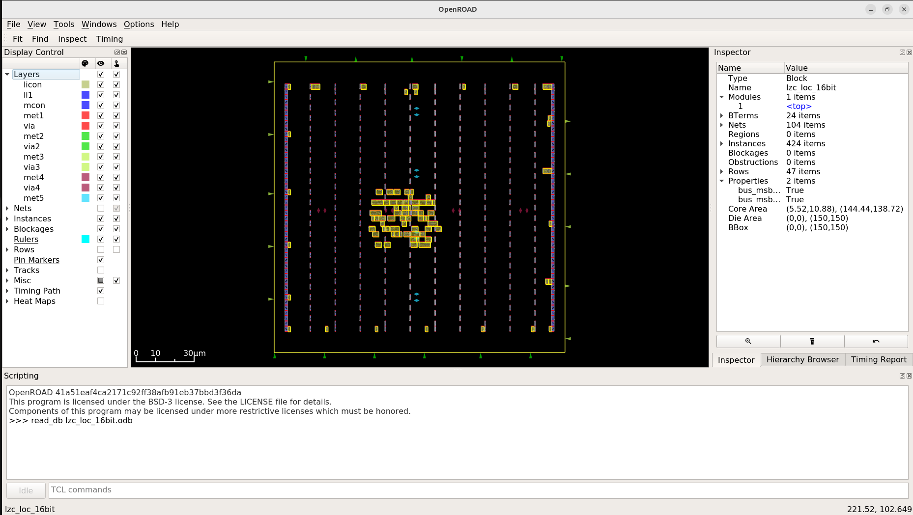
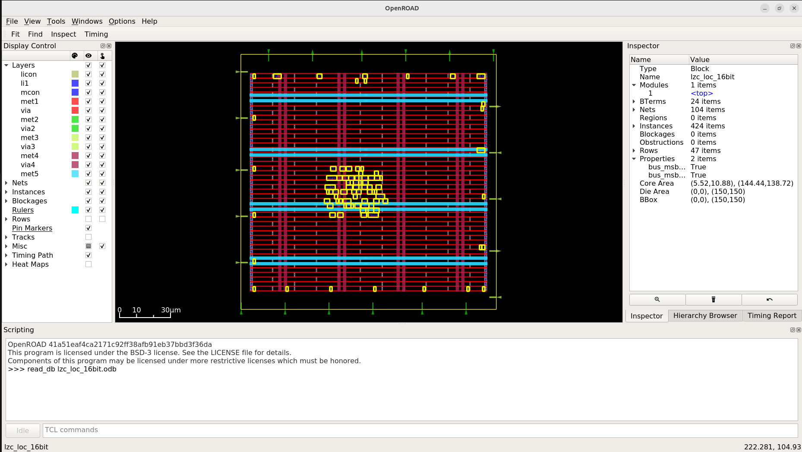
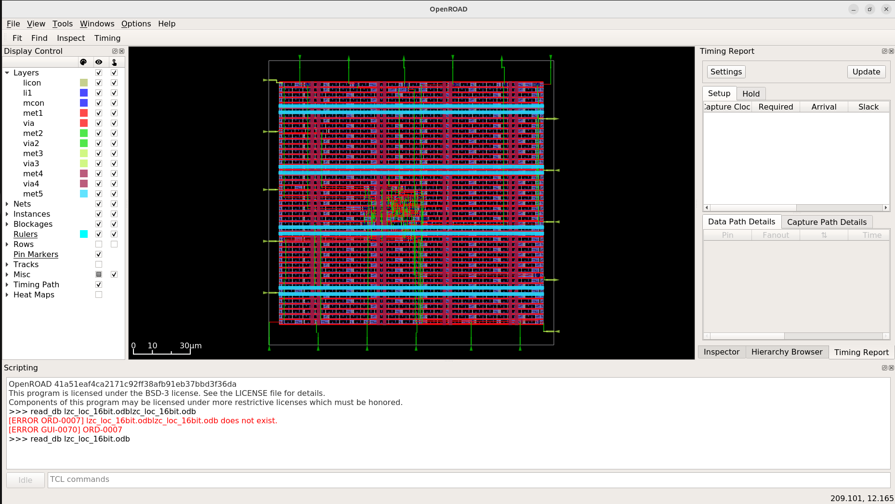
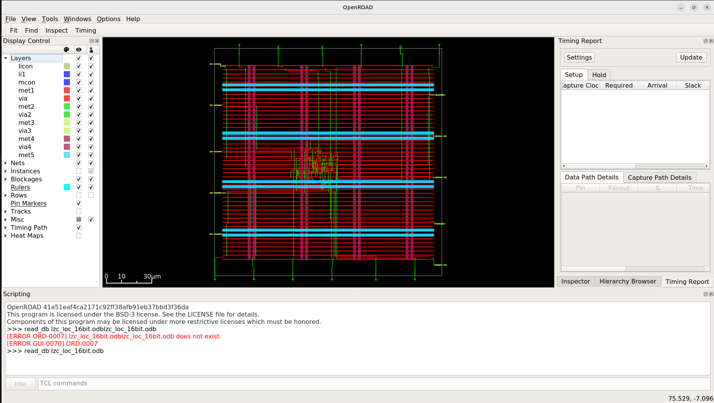
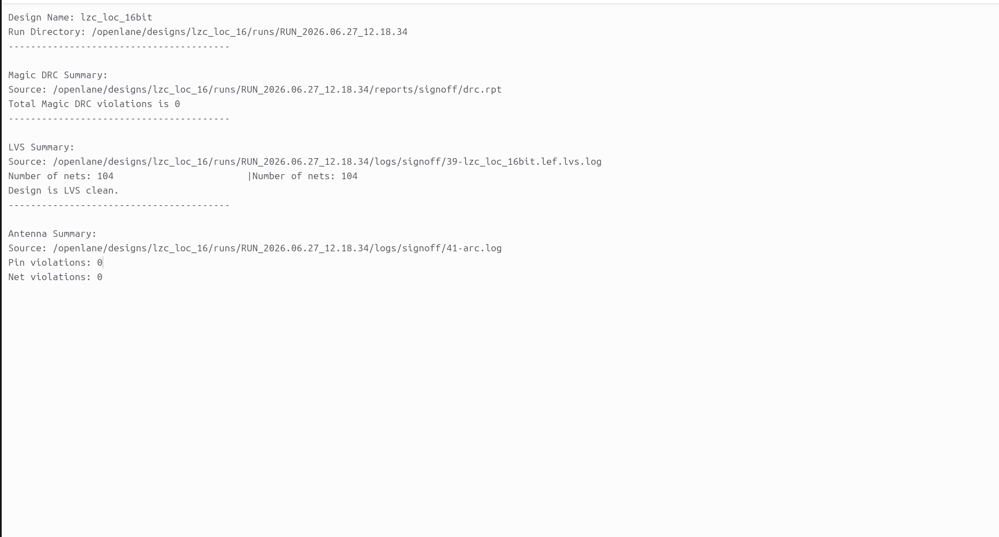

<div align="center">

# 16-Bit Leading Zero/One Counter (lzc_loc_16) - Complete ASIC Flow 🚀
### High-Performance Combinational Logic Implemented in Sky130

[](https://github.com/The-OpenROAD-Project/OpenLane)
[](https://github.com/google/skywater-pdk)
[](#)

*A high-performance LZC/LOC macro optimized for timing closure and silicon efficiency.*



---
**[Overview](#-project-overview) • [Floorplan](#-floorplanning) • [Placement](#-placement) • [CTS](#-clock-tree-synthesis) • [Signoff](#-signoff-and-manufacturability)**
</div>

---

## 🏗️ Project Overview

The **16-bit LZC/LOC** is a critical combinational module used for normalization in DSP pipelines and floating-point units. This design employs a hierarchical priority encoding tree to achieve logarithmic gate delay, ensuring high-speed identification of the first '0' (for LZC) or '1' (for LOC).

## 📐 Floorplanning
The floorplan stage established the die boundary and macro aspect ratio. We implemented a robust Power Delivery Network (PDN) with vertical and horizontal metal stripes to ensure stable voltage distribution across the logic core.
<p align="center">
  
</p>

## 📍 Placement
Standard cell placement was optimized to reduce wire length for the priority tree logic. We ensured legal cell placement and high-density row utilization while minimizing congestion in the critical signal paths.
<p align="center">
  
  
</p>

## ⏱️ Clock Tree Synthesis (CTS)
CTS was executed to balance the clock skew across the 16-bit logic paths. High-drive buffers were systematically inserted to maintain signal integrity and ensure strict timing closure across the priority encoder stages.

<p align="center">
  
</p>

## 🛣️ Routing & Physical Verification
The final detailed routing phase successfully connected all nets while strictly adhering to foundry-specific design rule constraints (DRC).
<p align="center">
  
   
</p>

## 📊 Signoff and Manufacturability
The macro successfully passed all foundry signoff requirements, confirming it is ready for tapeout:
* **Magic DRC:** 0 Violations (Clean) ✅
* **LVS:** Layout-to-Netlist Match (Clean) ✅
* **Antenna Rules:** 0 Violations ✅

<p align="center">
  
</p>

---

## 🚀 How to Reproduce
### 1. Verify RTL:
   ```
   iverilog -o tb_lzc src/lzc_16.v src/tb_lzc_16.v
   vvp tb_lzc
   ```
 ### 2.  Execute ASIC Flow:
```
    make mount
    ./flow.tcl -design lzc_loc_16
```
## 🤝 Acknowledgments

This implementation leverages the open-source SkyWater 130nm PDK and the OpenLane ASIC flow. I acknowledge the OpenROAD and YosysHQ development teams for providing the robust infrastructure necessary to move from abstract RTL to verified silicon geometry.

## Author: Madhu Kumar


